# To Update the Plugin:
Follow the same installation instructions below. Most required python packages will already be installed, and the necessary files will automatically be overwritten.

# Installation Instructions

# Before Installing:
* Identify your version of Origin.
    * Automatic install is confirmed for 2025 and 2026 releases.
    * Manual Install is required for 2022-2024 releases
    * This plugin is not compatible with Origin 2021 or earlier
* Make sure embedded python is installed.
    * Double check in Origin by navigating to Connectivity > Python Console...

        | Opening the python console | View from the python console |
        | :---------------------------: | :-----------------------------: |
        | 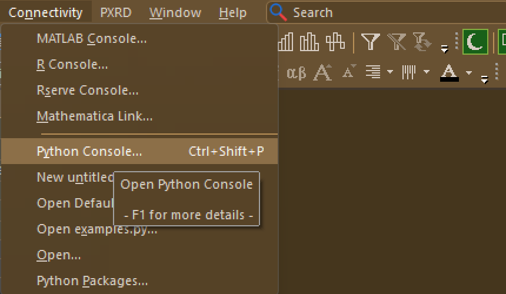 | 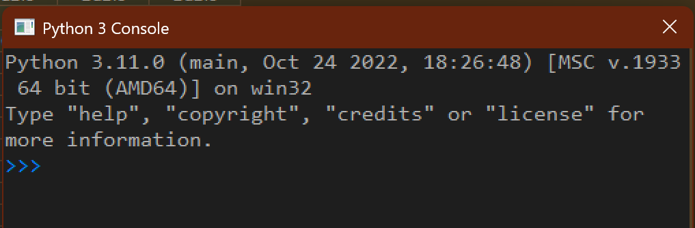 |

    * If necessary, add the embedded python to your installation by right-clicking in the start menu > Open File Location, and running the install repair tool to modify the installation

        | Find the install repair tool | Modify the installation |
        | :---------------------------: | :-----------------------------: |
        | 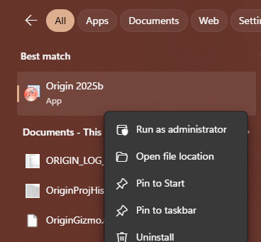 | 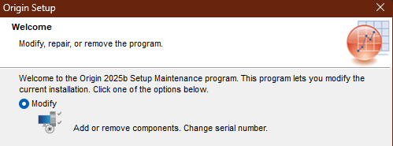 |
        | 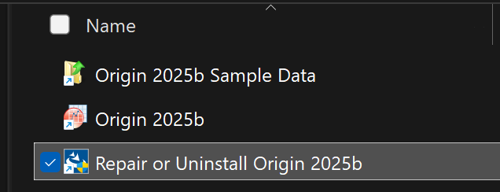 | 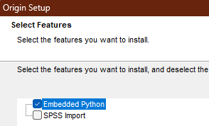 |

* Other Windows to Recognize:

    | Labtalk Script Window | CMD Window |
    | :---------------------------: | :-----------------------------: |
    | This window is used to run Origin Labtalk commands.<br>It is also used during manual installation to manually request python packages. | This window will be opened by Origin to install any requested python packages |
    | 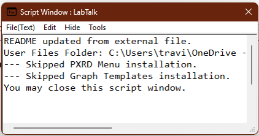 | 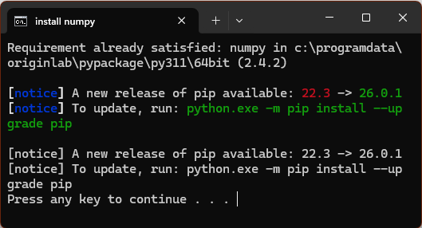 |


# Automatic Install (Origin 2025 or later):

<!--start recent installer link-->
[Click Here to Download the most recent installer](../installer/release/OriginPXRD_Installer_v1.3.4-65-g93d0faa.exe)
<!--end recent installer link-->

1. Download and run the installer at the link above. You may need to tell your browser to trust the file. Once run, it will open the installation project inside Origin.

---
1. In the dialog, select which plugin features you want to install, then select OK.

    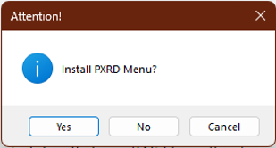
---
1. If prompted, install any requested python packages. Origin will open an embedded command prompt window to install necessary python packages. This may take longer than 10 minutes, depending on processing speed and internet connection.

    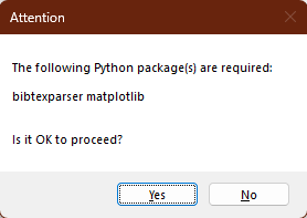

    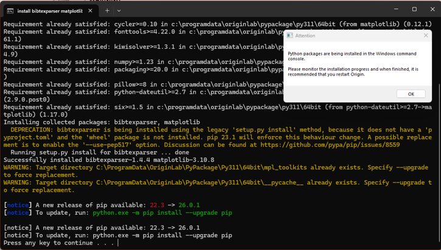

    * While waiting on package install, check on the Labtalk window for confirmation or error messages

        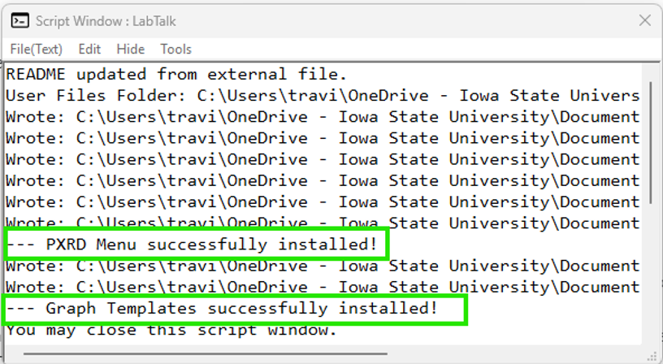
---
1. After the python packages have been installed (CMD line should end with "Press any key to continue..."), save the Origin project (It will be deleted shortly, but Origin will not release it for deletion until it's saved.) and close all copies of Origin.
---
1. If using the automatic installer, a CMD window should appear that will clean up the installation files from their temporary directory. **Do not close this window, it will close itself after cleaning up**
    * The cleanup window may ask you to close all copies of Origin from task manager. This is because Origin keeps recent files open in the background and prevents their deletion, including some installation files.

        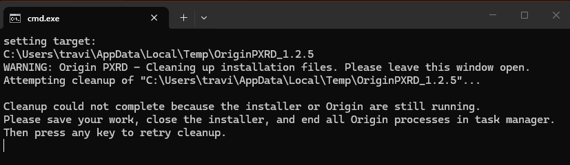
---
1. Review the [instructions for use](../instructions.md) for further guidance.

# Manual Install (Origin 2022-2024)
**Disclaimer:** This plugin should work as far back as Origin 2022. However, it has only been tested for 2024 or later. 

<!--start recent zip link-->
[Click Here to Download the most recent zip package](../manual_install/OriginPXRD_v1.3.4-65-g93d0faa.zip)
<!--end recent zip link-->

1. Locate your Origin User Files Folder.
    * In Origin 2024 or later, your user files folder can be found from inside Origin: Help > Open Folder > User Files Folder

        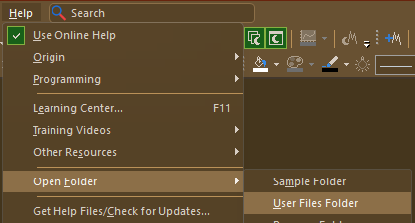
---
1. Download the most recent zip package at the link above and extract it to an easy-to-find location

    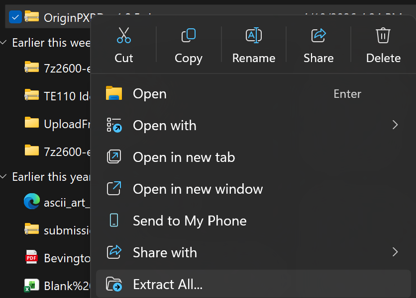
---
1. For each option that you want to install, copy the entire contents of the corresponding option folder into the user files folder.
    * For example: If you want to install the PXRD Menu, open the PXRD Menu folder and copy cifImp.py, cifPicker.py, PXRD.omc, etc... directly into the user file folder

    * Some option folders contain additional folders inside them. The folder itself needs to be put inside the user files folder, then the files inside stay inside that folder. If the folder already exists in the user files folder, make sure the new files are inside that folder after copying.
      - Example: The In-Situ Beamline option has a folder inside called Filters. This matches the Filters folder inside the User Files Folder. The *.oif files in that folder need to end up inside User Files/Filters/.

        
    | Copy files from option folder | Paste them into the user files folder |
    | :---: | :---: |
    | You must do this for every option folder you want to install | If you paste a folder that already exists, it should automatically "merge" the two folders. |
    | 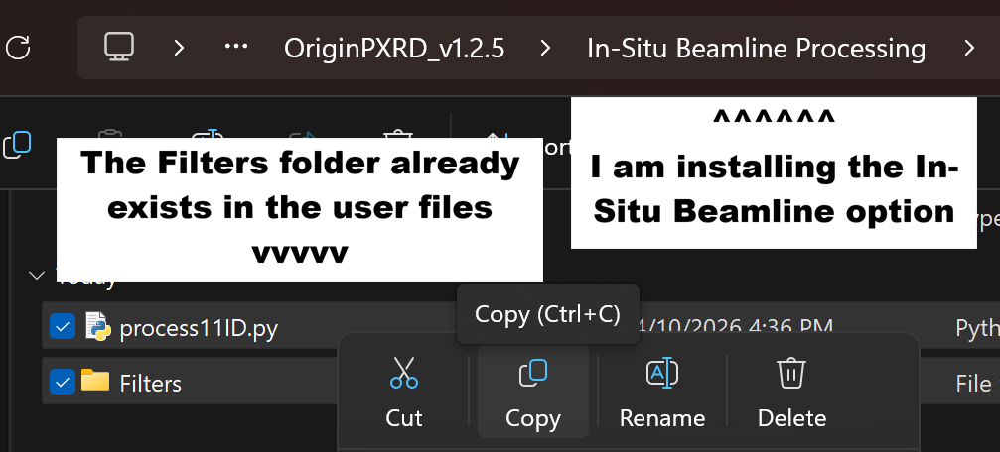 | 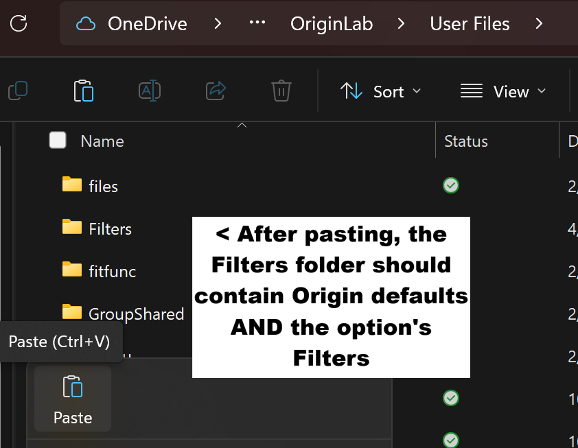 |
---
1. In Origin, open the script window with: Window > Script Window

    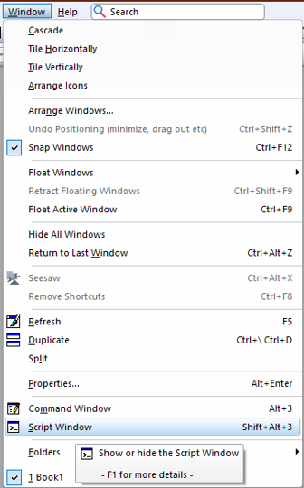
---
1. Copy/Paste the ENTIRE command below as one line into the script window:
    ```
    pip -chk numpy bibtexparser matplotlib monty narwhals orjson palettable pandas plotly pymatgen requests scipy spglib sympy tabulate tqdm uncertainties
    ```
2. Ensure that your text cursor is at the end of the pasted line (not on a new line) and press \<Enter\>

    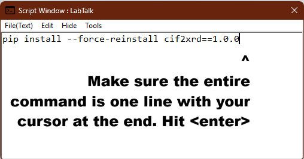
---
1. If prompted, install any requested python packages. Origin will open an embedded command prompt window to install necessary python packages. This may take longer than 10 minutes, depending on processing speed and internet connection.

    

    
---
1. After the python packages have been installed (CMD line should end with "Press any key to continue..."), close and restart Origin with a fresh project.
2.  Review the [instructions for use](../instructions.md) for further guidance.
