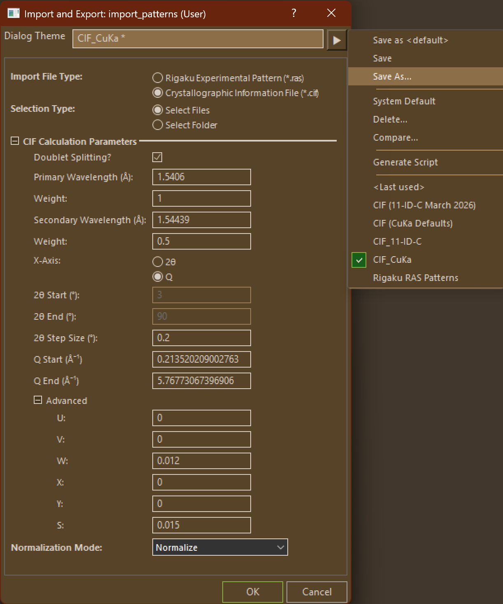
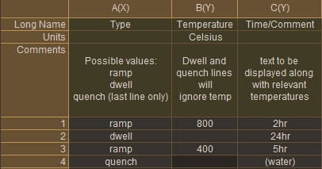
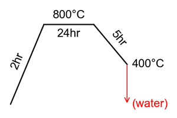
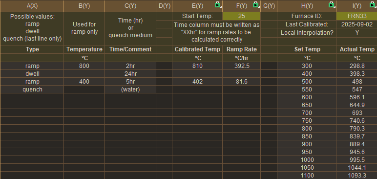
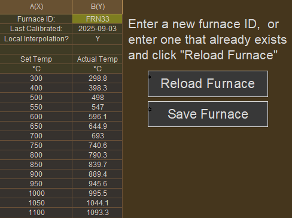
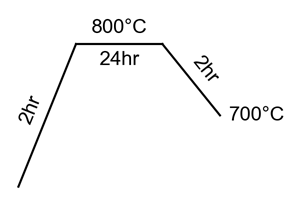
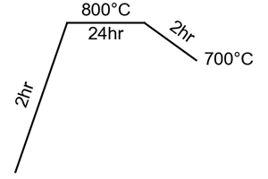

# How To Use the Plugin <!-- omit from toc -->

## On This Page: <!-- omit from toc -->
- [If "PXRD" dropdown does not appear:](#if-pxrd-dropdown-does-not-appear)
- [PXRD Menu Options:](#pxrd-menu-options)
- [Import Pattern Dialog Options](#import-pattern-dialog-options)
  - [\[BETA\] Phase Fraction Analysis](#beta-phase-fraction-analysis)
- [\[NEW\] Annealing Profiles Dropdown](#new-annealing-profiles-dropdown)
- [Using and Editing Furnace Calibration Data](#using-and-editing-furnace-calibration-data)
  - [Selecting your furnace](#selecting-your-furnace)
  - [Calibrated Temperatures](#calibrated-temperatures)
  - [Editing furnace data](#editing-furnace-data)
  - [Printing Calibration Reports](#printing-calibration-reports)
- [Annealing Profile Dialog Options](#annealing-profile-dialog-options)
- [Graph Templates](#graph-templates)

**Please Note:** If you opted to install Graph Templates without the PXRD Menu, they will work independently (See [Graph Templates](#graph-templates)). Some other options (like In-Situ processing) are available to install independently, but require you to execute commands through the script window if you did not install the menu.

**After installing the plugin (with PXRD Menu) and restarting Origin, a new dropdown should appear on the top banner titled 'PXRD'**

## If "PXRD" dropdown does not appear:
1. Select Preferences > Custom Menu Organizer
2. Verify that there is an entry titled "PXRD"
3. If the entry is not there, inside the menu organizer, select File > Open... and search for PXRD.omc in the User Files Folder
4. Close the menu organizer and look for the dropdown

### If "PXRD" dropdown STILL does not appear: <!-- omit from toc -->
You may need to switch GUI mode.

<ins>**Origin 2025b:**</ins> Preferences > GUI Mode > PXRD

<ins>**Origin 2024–2025:**</ins> Preferences > Menu > PXRD

---

## PXRD Menu Options:

<ins>**Import Patterns:**</ins> Import experimental patterns or calculate theoretical patterns from CIF files. 

* <ins>**Full Dialog...:**</ins> Opens the [custom dialog](#import-pattern-dialog-options) to edit parameters, or to save/load your own preset themes
* <ins>**\<Last Used\>**</ins> Without opening the dialog, executes the last used set of import settings. Re-prompts for file selection.
* <ins>**CIF Patterns (CuKa Defaults)**</ins> Without opening the dialog, imports with preset settings for Cu-Ka splitting (2θ 3-90°, step size 0.02°). Re-prompts for file selection.
* <ins>**CIF Patterns (11-ID-C March 2026)**</ins> Without opening the dialog, imports with preset settings to match 11-ID-C. 2θ range and step size are similar to in-situ values, and peak shape parameters were estimated by Rietveld analysis. Re-prompts for file selection.
* <ins>**Experimental Patterns (*.ras)**</ins> Without opening the dialog, imports with preset settings for experimental patterns from the Rigaku Miniflex. Re-prompts for file selection.

<ins>**Transform Columns:**</ins> These options only appear when a worksheet is open in Origin

  | | Selection Methods for Transformations |
  | ---: | :--- |
  | <ins>**All "AU" or All "deg":**</ins> | Adds the new column for every column in the current worksheet with matching units. |
  | <ins>**Select Columns:**</ins> | Adds the new column for each column selected in Origin. |

* <ins>**Add Q Columns:**</ins> Adds a new column in Q-Space next to each applicable column (see selection methods below). Q-Space is dynamically calculated using the value in the "Wavelength" row of the source column.
* <ins>**Rescale Columns:**</ins> Adds a new column next to each applicable column (see selection methods below) with a new row titled "ScaleFactor". Data from the original column is multiplied by the scale factor in the new column. Scale factors can be adjusted and columns will auto-update.
* <ins>**Square Columns:**</ins> Adds a new column next to each applicable column (see selection methods below) that squares the values in the original column.
* <ins>**Sqrt Columns:**</ins> Adds a new column next to each applicable column (see selection methods below) that takes the square root of values in the original column.

<ins>**In-Situ Processing:**</ins> Macros for processing metadata and importing patterns from in-situ beamtimes.

* <ins>**11-ID-C (March 2026):**</ins> Normalizes all patterns (normalized by data set, not by individual pattern) and extracts temperature from all metadata files. Adds temperature as a "Temp" row at the top.

<ins>**Annealing Profiles:**</ins> A quick tool to generate diagrams for annealing profiles.

* <ins>**Get Template:**</ins> Creates a template worksheet to edit your annealing profile and adjust diagram settings.
* <ins>**Generate Diagram:**</ins> Generates an annealing profile diagram from the current template worksheet.

---
## Import Pattern Dialog Options

  

If you have your own set of custom parameters that you like to use for your own analysis, you can save them as a theme using the menu on the top right of the dialog.

|Option | | Description |
| :--- | :--- | :--- |
| New Workbook Name | | Name your imported workbook. All import commands create a new workbook to simplify import and normalization.
| Import File Type | | Select whether you are importing experimental patterns (\*.ras) or calculating theoretical patterns (\*.cif) |
| Selection Type | | Select how you will be selecting your import files after clicking "OK" **Select Files:** Select one or more individual files by selecting and adding them to the dialog. **Select Folder:** Select a folder and import all matching files at once. |
| <ins>**CIF Calculation Parameters**</ins> | Only used for CIF Imports. |
| | Doublet Splitting? | Specify if you would like to simulate peak splitting as a result of 2 different incident wavelengths |
| | Primary Wavelength (Å) Secondary Wavelength (Å) | X-Ray wavelengths. Secondary wavelength only used when Doublet Splitting is enabled. |
| | Weight | Relative weights of Primary and Secondary Wavelengths. Only used when Doublet Splitting is enabled. |
| | X-Axis | Specifies which X-Axis you would like to use. **2θ**: Calculates intensity for the range of 2θ values specified. **Q**: Calculates intensity for the Q range specified. 2θ column will still be generated for reference. |
| | 2θ Start (°) | Beginning of 2θ range. Auto-calculated in Q mode.
| | 2θ End (°) | End of 2θ range. Auto-calculated in Q mode.
| | 2θ Step Size (°) | Patterns will be calculated by incrementing 2θ _regardless of Q mode_. Q Mode can specify range in Q values, but the increment will still be in 2θ. |
| | Q Start (Å⁻¹) | Beginning of Q range. Not available in 2θ mode. |
| | Q End (Å⁻¹) | End of Q range. Not available in 2θ mode. |
| | Advanced Parameters | Used to adjust peak broadening and dampening. |
| Normalization Mode | | Specify whether to normalize imported or calculated patterns. During CIF import, an extra option is available to add scaling for each imported CIF by the relative phase fractions in your analysis. See the Phase Fraction section below. |
| Specify Fraction Type | | Choose which phase fraction you want to specify when scaling your patterns. More information on each type can be found on the [CIF Calculation Method Page](./phase_frac.md#choosing-your-phase-fraction) |

### [BETA] Phase Fraction Analysis
If you select this option under **Normalization Mode** during CIF import, the files will be imported as usual (without normalization), but additional columns will be added to scale phases by their relative fractions present in your analysis. Column types are specified by 'Norm Type' row:
- **Raw Data**: Original, non-normalized calculated patterns
- **Phase-scaled**: Scales original patterns by the value in the 'Phase Fraction' row. <ins>Edits to phase fractions will affect all columns except original</ins>
  - Convention dictates that phase fractions should add to 1, but this is not required.
- **Max Phase**: Preserving relative phase fractions, normalizes all patterns so that the max intensity across all phases is 1.0.
- **Sum**: Preserving relative phase fractions, normalizes all patterns so that the max intensity is 1.0 when all phases are summed.
- **Normalized, All Phases**: Final column calculated as the sum of all phases, preserving relative phase fractions. This should match a normalized experimental pattern.

The type of phase fraction you want to specify is chosen during the [import dialog.](#import-pattern-dialog-options) More information about each type of phase fraction can be found on the [phase fraction derivation page.](./phase_frac.md#choosing-your-phase-fraction)

Phase Fractions are specified under the **Phase-Scaled** columns only. All the other columns will update from these columns. **Typing a phase fraction under any other column will not change any scaling.**

#### WARNING: <!-- omit from toc -->
**Accuracy of fraction scaling is still being verified. [My current from-principles method is outlined here](./phase_frac.md)**
**Fraction Scaling relies on a calculation of Z by reducing the cell contents to the minimum formula. This may lead to occasional differences in expected vs. calculated Z values.**
- You can check the value of Z calculated for your structure in the hidden user parameter row.
  - Select the entire fraction row and right-click > edit column label rows...
  - Find the Z label and select "Show" before clicking OK.
- If you suspect that Z is not being correctly calculated for your structure, reach out to Travis or [fill out a bug report.](./#bug-reports-or-feature-requests)

---
## [NEW\] Annealing Profiles Dropdown

| Example Annealing Profile | Resulting Diagram |
| --- | --- |
|  |  |

<ins>**Get Annealing Template:**</ins> Generates a worksheet template to generate annealing diagrams. *This worksheet can also be used to calculate program temperatures using furnace calibration data.*

<ins>**Generate Diagram:**</ins> Generates an annealing profile diagram from the current template worksheet.

* <ins>**Full Dialog...:**</ins> [Set parameters](#annealing-profile-dialog-options) or open your own theme to generate an annealing diagram from the current worksheet. Recommended to use with generated template worksheet.
* <ins>**\<Default\>**</ins> Generate an annealing diagram from the current worksheet using default settings. Recommended to use with generated template worksheet.
* <ins>**\<Last Used\>**</ins> Generate an annealing diagram from the current worksheet using the last used settings. Recommended to use with generated template worksheet.

<ins>**New/Edit Furnace:**</ins>Opens a new worksheet to edit calibration data or add a new furnace to your saved data.

---
## Using and Editing Furnace Calibration Data

When editing your annealing profile (using *Annealing Profiles > Get Annealing Template*), there are additional columns for calculating calibrated temperatures based on data stored in your copy of Origin.

### Selecting your furnace
Changing the furnace ID stored in the highlighted cell in **column I** will check for calibration data stored under that ID. If calibration data is found, it will automatically load the information and use it to calculate temperatures for you.

### Calibrated Temperatures
After successfully loading your calibration data, **columns E:F** will give you the calibrated settings to input into your furnace. For example, in the image above, the desired temperature (column B) is 800 degrees, but column E calculates that the furnace must be set to 810 degrees to account for the calibration data stored for FRN33. It also calculated the corresponding ramp rate, assuming that your furnace starts at 25 degrees celsius.

### Editing furnace data
Furnace data cannot be edited in the annealing worksheet, only loaded. Instead, navigate to *Annealing Profiles > New/Edit Furnace* to open a furnace worksheet.

* To create a new furnace, enter a furnace ID that has not been used before, enter all the necessary data, and click "Save Furnace".
* Existing furnaces can be edited by entering their ID and clicking "Reload Furnace". Make any necessary edits before clicking "Save Furnace".
* For a list of already existing furnaces, navigate to the "Furnace List" worksheet tab in the furnace workbook.

### Printing Calibration Reports
Once you have entered all the calibration data for your furnace, you can print a report to attach to the fume hood. Navigate to the "Print" tab of the furnace workbook, then go to *File > Print Preview* to make sure everything is displayed before printing.

---
## Annealing Profile Dialog Options

| Option | Description |
| --- | --- |
| Start Temperature | Initial Temperature in degrees celsius (usually 25). |
| Minimum Height | All unique temperatures will be evenly spaced by this height (not to scale). For example, in the diagram below, the initial temperature, max temperature (800) and the end temperature (700) are all evenly spaced regardless of scale.   If desired, you can space temperatures differently using the **Extra Temperatures** option. |
|Extra Temperatures | In order to increase the height between two specific temperatures, you can add unique temperatures that you want to include in the spacing, but which aren't already in your profile. For example, the diagram below was made more scale-appropriate by adding **100; 200** to the extra temperatures field. This essentially reserves additional y-axis space for 100 and 200 degrees, without actually graphing them.  Multiple temperature values must be semicolon separated, as in: **100; 200; 300** | 
| Ramp Width | All ramp sections will be this width by default. Individual sections will automatically widen for longer labels. |
| Dwell Width | All dwell section will be this width by default. Individual sections will automatically widen for longer labels. |
| Font Size | Text label font size |
| Font | Text label font family. Can't use your preferred font? [Submit a feature request.](./#bug-reports-or-feature-requests) |
| Text Offset | The amount of space added between the line graph and text labels. |
| Line Width | Thickness of the line graph |
| Margins | Adjust the margins around the diagram when saving. Text labels may occasionally be cut off by margins, increase the offending margin accordingly. |

## Graph Templates
Installed graph templates can be found in Plot > User Templates
* <ins>**Stacked PXRD:**</ins> Each plot is offset by one unit. Good for displaying multiple normalized patterns.
* <ins>**Sample+Refs:**</ins> The first added plots are displayed as full-sized patterns on the top portion. Additional patterns can be added to the "Reference Patterns" layer to be displayed below at 1/2 scale.
* <ins>**In-Situ Contour:**</ins> Typical in-situ contour plot. Intended for data sets normalized to [0,1]. Can be constructed to use a parameter row (such as the "Temp" row generated during In-Situ import) as the y-axis.
* <ins>**In-Situ Browser**</ins> Puts all selected columns into a "browser" graph that allows you to scroll through many patterns. Select multiple rows on the left panel to overlay patterns.

---
